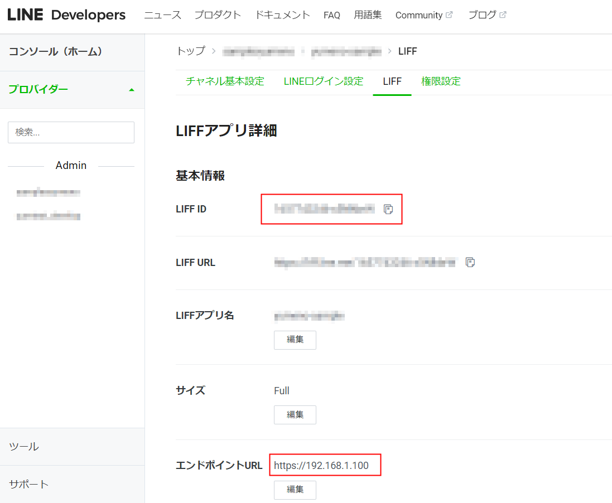

# Getting Started with Create React App

This project was bootstrapped with [Create React App](https://github.com/facebook/create-react-app).

## Available Scripts

In the project directory, you can run:

### `npm start`
### `npm run build`

# 設定を変更するところ
envファイルのline-のIDを変更してください。
REACT_APP_VITE_APP_LIFF_ID="＊＊＊＊＊＊＊"

LineのエンドポイントURLも開発環境に合わせてipアドレスを入力してください。

